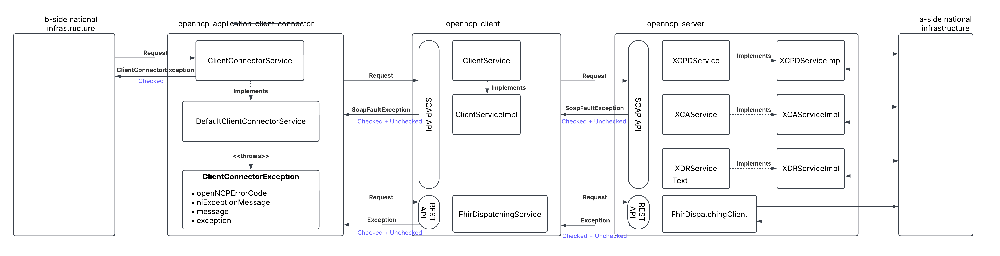

=== Introduction

In OpenNCP, there are two types of exceptions:

- checked exceptions.
- unchecked (runtime) exceptions.

==== HL7 CDA-based services

For the classical HL7 CDA based services SOAP APIs are provided and in the case of an exception, a SOAPFaultException is returned to the caller.
In the case of a checked exception, the SOAPFaultException is populated with the OpenNCPErrorCode and an exception message related with this code, possibly concatenated with the National Infrastructure exception message is passed in the SoapFaultException.

In the DefaultClientConnectorService, all Throwables are catched and transformed into a ClientConnectorException that contains following fields:

- *openNCPErrorCode*, containing the code and message related to the checked exception.
- *niExceptionMessage*, exception message that is returned by the A-side national infrastructure.
- *message*, in the case an unchecked exception occured.
- *Throwable*, the Throwable itself, that contains the stackTrace of the exception.

==== HL7 FHIR-based services

For the HL7 CDA based services REST APIs are provided and in the case of a checked exception, it is included in the ResponseEntity body.
In the case of an unchecked exception, it is transformed into a ClientConnectorException (see above) which is then returned to the B-side national infrastructure.

